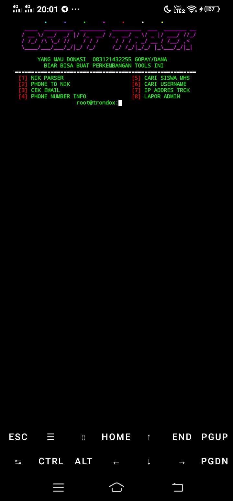

# TOOLSDARKV4 

Repository ini berisi koleksi alat dan skrip untuk Termux.

## Screenshot



## Instalasi

Untuk menggunakan alat-alat ini, ikuti langkah-langkah instalasi di bawah ini di Termux:

```bash
pkg update
pkg install nala -y
nala install git bash -y
nala install sox mpv -y
nala install cowsay ruby -y
nala install binutils zip unzip -y
gem install lolcat
git clone https://github.com/Sokheker/TRONDOX
## on Linux all
sudo apt update
sudo apt install nala -y
nala install git bash -y
nala install sox mpv -y
nala install cowsay ruby -y
nala install binutils zip unzip -y
gem install lolcat
git clone https://github.com/Sokheker/TRONDOX
cd TRONDOX
cd lib_base
npm i ( tunggu sampe selesai )
exit
bash TRONDOX.sh
# TRONDOX
